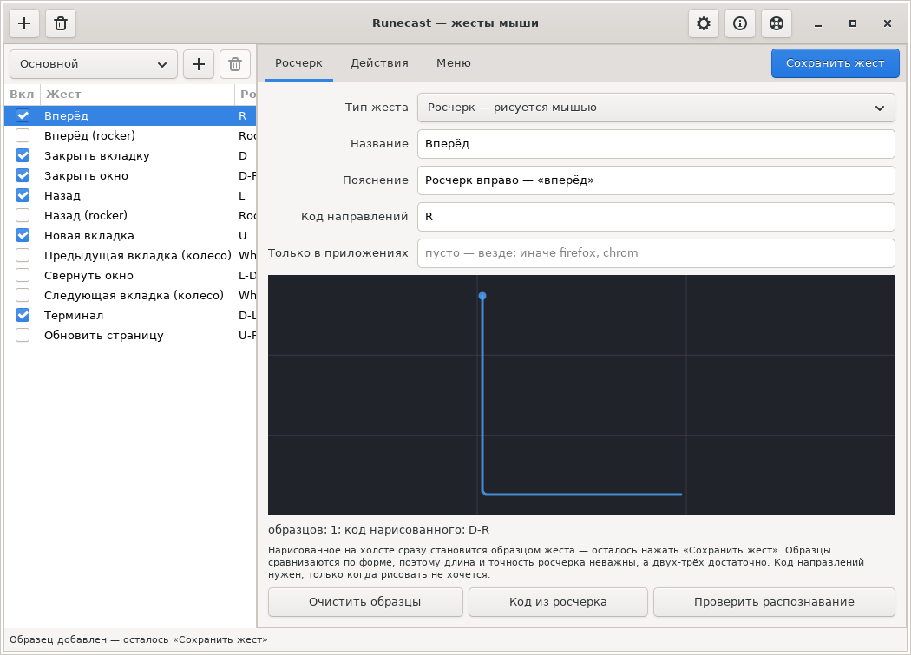
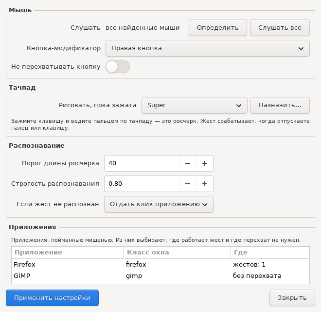

**English** | [Русский](README.ru.md)

# Glyphstroke

Mouse gestures for Linux in the spirit of StrokeIt and Symbol Commander: hold
the right button, draw a sign on the screen, release it — the bound action
runs. The plain right click keeps working, and no context menu flashes.

Written for Ubuntu, works **both in X11 and in Wayland**: the capture happens
at the kernel level through `evdev` and `uinput` rather than through the X
server. That is what sets it apart from easystroke, which lives in X11 only.



## What it does

* A stroke with the right (or middle, or side) button runs an action.
* Two ways to describe a gesture: **draw samples** (the $1 Unistroke algorithm
  compares the shape) or **write a direction code** such as `D-R` — "down,
  then right".
* Actions: a standard action of the system from a list, a shell command, a key
  combination, typed text, a mouse click,
  scrolling, a pause — several in a row.
* A gesture can open a **menu** — a list of actions at the cursor, if you give
  it items; with no items everything stays as before.
* A gesture can be limited to an application (in X11, sway, Hyprland).
* **Gesture sets**: several sets that switch as a whole — an ordinary one, one
  for games, one for work.
* A graphical gesture editor that records strokes right in the window; the
  settings of the program live in their own window, split into groups.
* All gestures export to and import from a single file.
* The capture can be paused — from the panel, from the editor or by command.
* **Turning off in fullscreen applications**: while a game is running or a
  video plays fullscreen, the mouse is let go by itself.
* The interface speaks English and Russian, the language comes from the system.
* An unrecognised stroke returns a plain click to the application by default —
  nothing is lost.
* A trail behind the cursor while drawing: in X11 the program draws it itself,
  in GNOME on Wayland the shell extension from the package does.

## System requirements

- An X11 or Wayland session.
- Python 3.9 or newer.
- Required: `python3-evdev`, `python3-yaml`.
- For the editor and the X11 trail: `python3-gi`, `gir1.2-gtk-3.0`,
  `python3-gi-cairo`.
- On GNOME under Wayland the trail, the gesture menu and window picking are done
  by a Shell extension — the daemon installs it into your home directory itself.
- Access to input devices: membership in the `input` group and the `uinput`
  module. The `.deb` and `install.sh` set all of this up.

## Installation

```bash
git clone <repository> glyphstroke-linux
cd glyphstroke-linux
./install.sh          # dependencies, /opt/glyphstroke, udev, the input group, the icon
```

The installer does everything itself: dependencies, access to the mouse,
autostart; the GNOME shell extension is put in place by the daemon at its first
run. One step is yours and cannot be avoided: **log out and log back in** — the
`input` group is picked up only at login, and GNOME loads extensions only when
a session starts.

Afterwards, if you like:

```bash
glyphstroke doctor          # check the permissions and find the mice
glyphstroke bind            # listen to a single mouse (a lone mouse binds at once)
glyphstroke gui             # the gesture editor
```

To remove it: `./uninstall.sh` (the settings in `~/.config/glyphstroke` stay).

### Updates

Once a day the program asks the releases page whether a newer version is out.
If it is, the editor shows a bar, `glyphstroke doctor` prints a line and `glyphstroke update`
checks right now. The program does not update itself: mouse capture is not the
place for a silent replacement — installing is up to you.

The check is visible and can be turned off: a switch in the editor settings
(the «Program» group) or `check_updates: false` in `settings.yaml`. Where the
releases come from is the `update_repo` setting — «owner/repository» on GitHub.

### A .deb package

```bash
./packaging/build-deb.sh                       # builds dist/glyphstroke_VERSION_all.deb
sudo apt install ./dist/glyphstroke_1.0.10_all.deb
```

The package puts the code into `/usr/lib/glyphstroke`, the `glyphstroke` and `glyphstroked`
commands into `/usr/bin`, and the desktop entry, the icons, the udev rule and
the documentation into their usual places; apt brings the dependencies. After
that all that is left is to give yourself the `input` group and log back in —
the package says so while installing. Removing is ordinary:
`sudo apt remove glyphstroke`, and the settings stay where they are.

When installed over an older version, the package reminds you to restart the
service and to install the shell extension again: GNOME loads the copy in your
home directory, and a package upgrade leaves that copy alone. `glyphstroke doctor`
notices both an old daemon and an outdated extension.

Building needs nothing but `dpkg-deb`: the package is assembled from a ready
tree, without debhelper and `debian/rules`. The version comes from
`glyphstroke/version.py`.

### Without the installer

```bash
sudo apt install python3-evdev python3-yaml python3-gi gir1.2-gtk-3.0 python3-gi-cairo
sudo usermod -aG input "$USER"     # then log back in
python3 -m glyphstroke.cli init
python3 -m glyphstroke.daemon         # run it in the terminal
```

## The default set of gestures

| Stroke | Code | Action |
|---|---|---|
| left | `L` | Back (`alt+Left`) |
| right | `R` | Forward (`alt+Right`) |
| up | `U` | New tab (`ctrl+t`) |
| down | `D` | Close tab (`ctrl+w`) |
| down, then right | `D-R` | Close window (`alt+F4`) |
| down, then left | `D-L` | Terminal |

One more gesture — "Reload the page" — is switched off and sits there as an
example of binding to particular applications.

## The trail behind the cursor

A line is drawn under the cursor while the modifier button is held. The way it
is drawn depends on the session, because the rights to "draw above every
window" and to "know where the pointer is" are handed out differently:

| Session | Who draws | What to do |
|---|---|---|
| X11 | a window of the daemon itself | nothing, it works right away |
| GNOME on Wayland | the shell extension | nothing: the daemon installs it itself, a re-login is needed |
| sway, Hyprland and other Wayland | nobody yet | no trail, the gestures work |

The look of the line is set in the editor settings — colour, width and opacity,
with a preview next to them — or straight in `settings.yaml`:

```yaml
overlay:
  enabled: true
  color: "#4da3ff"
  width: 4
  opacity: 0.9     # 0…1, where 1 is a solid line
  fade_ms: 220     # how long the trail fades after the release
```

The extension is installed by the daemon itself at startup: it compares the
version of the copy in `~/.local/share/gnome-shell/extensions` with the one
shipped with the program and refreshes it when the copy is out of date. There
is nothing to do by hand on purpose — a package installer reaches neither
somebody else's home directory nor their session bus, while the daemon already
runs inside the user session. The only thing left for a human is to log back
in: the shell loads new extensions only when a session starts.

The commands, in case you want to step in:

```bash
glyphstroke shell-extension status    # the state of the extension and of the channel
glyphstroke shell-extension install   # install and enable it right now
glyphstroke shell-extension remove
```

The extension does three things: it draws the trail, presses keys and works
with windows instead of the daemon, and it adds an icon to the top panel with
a switch for the capture.

The shell loads extensions when the session starts, so after installing one
you have to log out and log back in. `install.sh` installs it on its own when
GNOME is present.

The daemon announces the start and the end of a stroke on the socket
`$XDG_RUNTIME_DIR/glyphstroke/overlay.sock`, and whoever draws connects to it as a
client. The daemon does not care whether anybody is listening, so a missing
extension changes nothing else.

## A menu under a gesture

A menu is an optional addition to a gesture. While it has no items nothing
changes: the gesture runs its own actions. As soon as the "Menu" tab of the
editor has at least one item, the same stroke opens a list at the cursor — one
shape instead of a dozen memorised ones.

```yaml
name: Editing
directions: [U]
actions: []                # own actions can be left out entirely
menu:
  - name: Copy
    actions:
      - {type: keys, value: ctrl+c}
  - name: Paste
    actions:
      - {type: keys, value: ctrl+v}
```

While the menu is open the mouse belongs to it: neither motion nor clicks reach
the system. That is why the cursor stands still and the item is chosen by the
distance travelled — one step down per item (`menu_step_px`). The wheel walks
the list as well.

| What you do | What happens |
|---|---|
| move down | the next item is highlighted |
| move up, back to where the gesture was | nothing is chosen |
| release the left button | the highlighted item runs |
| release the right one (or any other) | the menu closes, nothing runs |
| stand still for `menu_timeout_ms` | the menu closes by itself |

The highlight is decided by the daemon and drawn by the shell extension (in X11
by the trail window), so the picture cannot disagree with what will actually
run. When there is nobody to draw — the extension is not installed and the
trail is off — the menu does not open: the gesture simply runs its own actions
and says so in the log. Who exactly would draw the menu is shown by
`glyphstroke doctor`.

## Pause

Sometimes the capture is in the way — in a program that needs the right button
for itself, say. Then it can be let go without stopping the service:

```bash
glyphstroke pause     # the mouse is released, the right button works as usual
glyphstroke resume
glyphstroke toggle
```

On pause the daemon actually drops the grab of the device instead of forwarding
events past itself, so the mouse behaves exactly as it does without our program.

The same is done by the "Gesture capture" switch in the editor settings and by
the icon in the GNOME top panel — it appears together with the shell extension.
Its menu has the capture switch, the current state and a way to open the
editor; the icon turns red while the capture is paused.

### Fullscreen applications

The "Turn off in fullscreen" setting (`pause_in_fullscreen`) drops the capture
while the active window is fullscreen: in a game the mouse belongs to the game.
Leave the game and the capture comes back on its own.

Being fullscreen is an ordinary property of a window, and it is taken from the
same place where the program learns about the active window: in X11 from
`_NET_WM_STATE`, in sway and Hyprland from their own commands, and in GNOME the
shell extension reports it. Where there is nothing to ask, the setting simply
does nothing.

A pause set or lifted by hand outranks ours: if you brought the capture back
while in the game, the program will not take it away again.

## Moving gestures around

All the gestures together with their actions go into one file — handy to carry
a setup to another machine or to keep it before experimenting:

```bash
glyphstroke export ~/gestures.yaml                  # the gestures only
glyphstroke export ~/everything.yaml --with-settings  # together with the settings
glyphstroke import ~/gestures.yaml                  # add them, replacing same-named ones
glyphstroke import ~/gestures.yaml --replace        # an exact copy: drop the previous ones
```

In the editor these are the "Export to a file…" and "Import from a file…"
buttons in the settings window (the gear in the header), the "Program" group.
While importing, gestures with matching names are replaced, and the program
warns about direction codes that are already taken.

## The window you draw over

The daemon holds the right click back, so the window under the cursor does not
get the focus by itself — and the key combination would go to the window that
was active before. On two monitors it shows immediately: you draw on the second
one and it fires on the first.

That is why the shell extension remembers the window under the cursor **at the
moment of the press** and activates it before the action runs. It is switched
off by `focus_under_cursor` in the settings.

Actions on the window itself need no key combinations at all:

```yaml
actions:
  - {type: window, value: minimize}
```

It understands `minimize`, `maximize`, `unmaximize`, `close`, `fullscreen`,
`unfullscreen`, `activate`, `above`, `unabove`. All of it is done by the shell
extension; in X11 without it `minimize`, `close` and `activate` are picked up by
`xdotool` when it is installed. The package has a switched-off example — the
"Minimise the window" gesture.

## Keys and the keyboard layout

A `keys` action can be sent in two ways, and the difference shows only with a
non-Latin layout.

**Through uinput** — the daemon presses keys by their codes, at the kernel
level. The compositor reads a code through the current layout: with a Russian
one `KEY_C` turns into "с", and the application does not recognise `Ctrl+C` in
it. Arrows, `F5` and other keys without a letter work in any layout, while
`ctrl+c`, `ctrl+w`, `ctrl+t` only work in the Latin one.

**Through the shell extension** — it sends a symbol rather than a key code, so
the layout stops meaning anything. It is the same extension that draws the
trail: while connecting to the daemon it says that it can press keys, and the
daemon hands the combinations over to it.

The choice is made by `keys_via` in the settings: `auto` (the default — through
the extension when it is on the line, otherwise uinput), `uinput` or `shell`.
What actually happened is shown by `glyphstroke watch`:

```
code U            → «Copy» (1.00)
  done: keys ctrl+c, keys through the shell
```

## Special gestures: rocker and wheel

Not every gesture has to be drawn. Two kinds fire at once:

| Event | What to do |
|---|---|
| `rocker-left` | while holding the right button, click the left one |
| `rocker-right` | while holding the left one, click the right one |
| `wheel-up`, `wheel-down` | the wheel while the modifier button is held |
| `wheel-left`, `wheel-right` | the horizontal wheel |

In the gesture file an event is written instead of a stroke:

```yaml
name: Back
event: rocker-left
actions:
  - {type: keys, value: alt+Left}
```

In the editor this is the "Gesture kind" list. A click or a scroll that became
a gesture does not reach the application: the page does not scroll and there is
no extra click. When an event is bound to nothing, everything works as usual.
The default set has four switched-off examples.

## Hints on the screen

- **The name of the gesture that fired** is shown on a plaque — you see at once
  what was recognised. Switched off by `show_gesture_name`.
- **The cheat sheet**: hold the button without moving the mouse and a list of
  gestures appears together with how to make each one. The delay is set by
  `hint_delay_ms`, zero switches it off.

In X11 both are drawn by the program itself, in GNOME on Wayland by the shell
extension: the name is shown by the standard on-screen display, the cheat sheet
by a panel in the middle of the screen.

## Drawing on the touchpad

On a laptop a gesture is drawn with a finger: hold Super and move a finger
across the touchpad. A stroke begins with a touch while the key is held and
ends when the finger is lifted or the key is released, whichever comes first.
A two-finger touch does not count as a stroke, that is scrolling.

The key is set in the settings, in the "Touchpad" group: from the list or by
pressing any key. In the settings file it looks like this:

```yaml
touchpad_key: KEY_LEFTMETA   # empty switches drawing on the touchpad off
```

The touchpad is not grabbed: the cursor follows the finger, as it follows the
mouse during an ordinary gesture, and the trail is drawn behind the cursor.
Scrolling, shell gestures and palm rejection stay with the touchpad. The
daemon does not grab the keyboard either: it reads it and watches one assigned
key, all other presses pass by without being remembered or logged. Keyboards
are read only when the system has a touchpad.

A menu under a gesture is navigated with a finger, and an item is chosen by
lifting the finger on it. A click on the touchpad is no good for choosing: the
touchpad is not grabbed, and the click would go to the application under the
cursor.

A lone Super in GNOME opens the overview when the key is released. After a
stroke this does not happen: the daemon tells the shell extension that Super
is busy with a stroke, and the extension skips one opening of the overview. In
other desktops Super may open their menu — assigning another key is easier
there.

The daemon does not need a mouse: on a laptop with just a touchpad it starts
all the same.

## One mouse instead of all of them

By default the daemon captures every mouse it finds. If there is only one, or
you need a particular one, bind it:

```bash
glyphstroke bind                 # a lone mouse binds silently
glyphstroke bind --ask           # press a button on the mouse you want
glyphstroke bind --clear         # back to every mouse
```

The same is done by the "Detect" button in the editor settings window, the
"Mouse" group:



The binding is stored as a permanent `/dev/input/by-id/...` link, which is built
from the vendor, the model and the serial number, so it survives a reboot and a
change of port. When there is no such link, `by-path` is taken, and the device
name as a last resort.

## How a gesture is recognised

There are two ways, and they are independent.

**Stroke samples.** What you draw is resampled to 64 evenly spaced points,
normalised by size and position and compared with your samples (the $1 Unistroke
Recognizer). Only the shape is compared: the length of the line, the scale, the
place on the screen and the shaking of your hand do not affect the result. Any
gesture is described this way, arcs, loops and letters included.

**A direction code.** The stroke is laid out into a string of octants such as
`D-R`. It is needed for exactly one thing — so that the set out of the box
works right away, before you have drawn anything: describing "left" in text is
cheaper than shipping somebody else's strokes. Codes are matched with a
tolerance rather than character by character: an extra neighbouring octant
(`L-DL` instead of `L`) costs almost nothing, while a jump across an octant
breaks the match.

In your own gesture the code field can be left empty — samples are enough. And
the other way round. If a gesture turns out ambiguous (what you drew looks
equally like two gestures), neither fires: `min_margin` is responsible for that.

## Gestures for one application

The "Only in applications" field (`apps` in the gesture file) limits a gesture.
There is no need to type the application in: a target sits next to the field.
Press it, drag it onto the window of the program you want and release — the
window class goes into the application list and is ticked for the gesture at
once. Applications already known are ticked in the list behind "Choose…".

Parsing goes in two passes — first the gestures of the current application,
then the global ones. That is why the same stroke can do different things in
different programs:

```yaml
# global: close the tab
name: Close tab
directions: [D]
actions: [{type: keys, value: ctrl+w}]
---
# in a code editor the same stroke deletes the line
name: Delete line
directions: [D]
apps: ["class:code"]
actions: [{type: keys, value: ctrl+shift+k}]
```

Such a pair is not a conflict: in its own application the application gesture
wins, everywhere else the global one works. Only gestures with the same stroke
and overlapping scope quarrel — `glyphstroke list` and `glyphstroke doctor` tell you about
those.

The opposite is a list of applications where no capture is needed at all. It is
chosen in the settings the same way, with the target or with ticks, and is
stored like this:

```yaml
excluded_apps: ["class:gimp", "class:krita"]
```

There the right button behaves as if our program did not exist: the press is
given to the application at once, without waiting for a stroke.

All caught applications live in `~/.config/glyphstroke/apps.yaml`, shared by every
gesture set, and are shown in the settings under "Applications". That is also
where they are removed: bindings are dropped in every set, and a gesture left
without any other application is switched off — otherwise a "Firefox only"
gesture would start working everywhere. The list travels with the gestures in
`glyphstroke export`.

An entry `class:name` is compared with the whole window class. A string without
the mark is a regular expression over "window class | title", as before: entries
from older files keep working and are shown in the list marked "expression". An
expression catches titles too, so `code` also fires in a browser tab whose title
happens to contain that word.

In GNOME on Wayland the active window and the window under the target are
reported to the daemon by the shell extension — without it, per-application
gestures and the exclusion list do not work there. On X11 the target works
without the extension.

## Gesture sets

A set is all the gestures at once. While there is only one set nothing changes:
the gestures live in `~/.config/glyphstroke/gestures/` as they always did. The
second one and the ones after it live in `~/.config/glyphstroke/profiles/NAME/`,
and then the editor shows a chooser above the list, and the terminal gets a
command:

```bash
glyphstroke profile                    # which sets exist and which one is current
glyphstroke profile new games --copy   # create one as a copy of the current set
glyphstroke profile new empty          # create an empty one
glyphstroke profile use games          # switch the whole set
glyphstroke profile use base           # back to the base set («-» works too)
glyphstroke profile remove games       # remove it together with its gestures
```

Switching changes everything at once — the gestures and their actions. The
per-application filter is good when the sets differ by a couple of gestures; a
set is good when they differ as a whole.

The current set is remembered in `settings.yaml` (`active_profile`), and the
daemon picks it up while re-reading the settings. The base set cannot be
removed; if the directory of a set disappears, the program quietly falls back
to the base one — being left with no gestures at all is worse.

## A gesture of your own

**In the editor** (`glyphstroke gui`): "＋", a name, draw a stroke on the canvas with
the left button — it becomes a sample right away (2–3 strokes and the
recognition gets steadier), choose what should happen on the "Actions" tab, and
"Save gesture". The "Check the recognition" button shows how what you drew is
scored.

**In the terminal**:

```bash
glyphstroke record "Minimise everything" -n 3 --keys "super+d"
glyphstroke watch       # what the running daemon recognises, right now
glyphstroke list
```

```bash
glyphstroke --version                 # the version of the installed package
glyphstroke doctor                        # among other things the version of the running daemon
glyphstroke watch --save ~/strokes        # save the strokes into files
```

`glyphstroke doctor` shows the version of the daemon that is running right now on a
line of its own. If it differs from the installed one, the service is spinning
old code and has to be restarted: `systemctl --user restart glyphstroke`.

`glyphstroke watch` shows how every stroke was parsed — the direction code, the gesture
and the score. It takes the mouse away from nobody: it reads the same channel
the trail is drawn from. `glyphstroke record` and `glyphstroke test`, on the contrary, do take
the mouse, so they stop the service while they work and start it again
afterwards.

## The settings files

`~/.config/glyphstroke/settings.yaml` — the general parameters:

| Parameter | Meaning |
|---|---|
| `trigger_button` | the modifier button: `BTN_RIGHT`, `BTN_MIDDLE`, `BTN_SIDE` |
| `capture_mode` | `grab` — capture the button; `monitor` — only watch |
| `min_stroke_px` | shorter than this path is a plain click, not a gesture |
| `min_score` | how strictly a sample has to match, 0…1 |
| `min_margin` | how far ahead of the second one the best match has to be |
| `unrecognized` | `passthrough` — give the click back, `ignore` — swallow it |
| `keys_via` | what presses the keys: `auto`, `uinput`, `shell` — see the section on layouts |
| `focus_under_cursor` | activate the window you started drawing over |
| `excluded_apps` | applications where there is no capture at all |
| `pause_in_fullscreen` | let the mouse go while the active window is fullscreen |
| `show_gesture_name` | show the name of the gesture that fired |
| `active_profile` | the current gesture set; empty is the base one |
| `hint_delay_ms` | after how many milliseconds of holding to show the cheat sheet |
| `menu_step_px` | how far to move down to reach the next menu item |
| `menu_timeout_ms` | after how many milliseconds without motion the menu closes itself |
| `press_passthrough_ms` | give the press to the application when the button is held without motion (for right-drag in games and CAD); 0 switches it off |
| `device_include` / `device_exclude` | choosing devices: the expressions are matched against the name and the paths, including the `by-id` links; easier to set with `glyphstroke bind` |
| `allow_touchpads` | capture touchpads as well (off by default) |
| `touchpad_key` | the key for drawing on the touchpad: while it is held, a finger draws a stroke (`KEY_LEFTMETA`, that is Super, by default); empty switches it off |

`~/.config/glyphstroke/profiles/NAME/` — the additional gesture sets, if any were
created; the files there are arranged the same way.

`~/.config/glyphstroke/gestures/*.yaml` — one file per gesture:

```yaml
name: Close window
enabled: true
directions: [D-R]          # the direction code; several variants are allowed
apps: []                   # empty is everywhere; otherwise "class:firefox" or an expression
rotation_tolerance: 20.0   # how much a sample may be rotated, degrees
actions:
  - {type: keys, value: alt+F4}
menu: []                   # menu items; without them the key is not in the file at all
templates: []              # stroke samples, if you drew them by hand
```

### Actions

| Type | Value | Example |
|---|---|---|
| `standard` | a standard action of the system, by name | `copy`, `paste`, `minimize` |
| `keys` | a combination or several in a row | `ctrl+w`, `alt+Left`, `ctrl+c ctrl+v` |
| `command` | a string for `/bin/sh -c` | `xdg-open ~/Downloads` |
| `app` | an application: a path to a `.desktop` file or to a program | `/usr/share/applications/firefox.desktop` |
| `text` | the text to type | `signature` |
| `button` | a mouse button and the number of clicks | `middle`, `back 2` |
| `scroll` | the direction and the number of wheel clicks | `up 3`, `down` |
| `window` | an action on the window you started drawing over | `minimize`, `maximize`, `close`, `fullscreen` |
| `delay` | a pause in milliseconds | `150` |

A standard action is picked from a list in the editor and stays a name in the
file: `copy`, `paste`, `cut`, `delete`, `undo`, `redo`, `select-all`, `new`,
`open`, `save`, `print`, `find`, `new-tab`, `close-tab`, `next-tab`,
`prev-tab`, `back`, `forward`, `refresh`, `zoom-in`, `zoom-out`, `zoom-reset`,
`minimize`, `maximize`, `unmaximize`, `fullscreen`, `close-window`,
`switch-window`, `quit`, `screenshot`. There is nothing to memorise, and such a
gesture moves to another system as it is: there the same action runs with that
system's own keys. The table lives in `glyphstroke/standard.py`.

Direction codes are built from eight octants: `R`, `DR`, `D`, `DL`, `L`, `UL`,
`U`, `UR` — joined with a dash in the order of drawing. Circles, arcs and
letters cannot be described by a code: draw samples for those.

## Limitations

* **The trail outside X11 needs the shell extension.** In Wayland an
  application is given neither the global pointer position nor the right to
  draw a window above everything (GNOME does not support `wlr-layer-shell`).
  For GNOME the extension is in the package; in sway, Hyprland and other
  compositors the trail is not drawn yet, the gestures work. The daemon does
  not start its own window in Wayland: it would attach to Xwayland and draw a
  polyline out of random coordinates.
* **The per-application filter** works in X11, sway and Hyprland. In GNOME on
  Wayland there is nothing to ask about the active window — gestures with a
  non-empty `apps` simply do not fire there, the global ones work.
* **Touchpads** are not captured by default: grabbing a touchpad deprives it of
  the libinput settings (natural scrolling, palm rejection). Drawing with a
  finger while a key is held does not need the grab. Capturing a touchpad as a
  mouse is switched on with `allow_touchpads: true`.
* **Super after a touchpad stroke** keeps the overview closed only in GNOME
  with the shell extension. In KDE and other desktops a released Super may open
  their menu — assigning another key is easier there.
* **The `text` action** types symbols according to the US layout: Latin letters
  and digits are the same everywhere, punctuation in other layouts may differ.
  Through the shell extension this limitation does not apply.
* The `input` group is required — that is access to every input device, the
  keyboard included. Every gesture interceptor under Linux works this way.

## When something goes wrong

```bash
glyphstroke doctor                          # permissions, devices, dependencies
systemctl --user status glyphstroke     # the state of the service
journalctl --user -u glyphstroke -f     # what the daemon sees
glyphstroke daemon --dry-run                # recognition without running anything
glyphstroke daemon --monitor                # do not capture the button at all
```

* **`doctor` says the `input` group is not in effect.** A group is handed out
  when you log in, so after `usermod` you have to log out and back in —
  restarting the terminal is not enough. In the current terminal you can check
  with `newgrp input`, but the `systemd --user` service will pick the group up
  only after a re-login.
* **A gesture does not fire although it is in the list.** Most likely its
  direction code is taken by another gesture as well: what you drew looks
  equally like both, and neither fires. `glyphstroke list` and `glyphstroke doctor` show such
  pairs, and in the editor they are marked with `⚠`.
* **The cursor stutters.** Make sure a fresh version is installed: the daemon
  used to walk every input device every two seconds right in the event
  forwarding thread. Binding to a single mouse helps as well — `glyphstroke bind`.
* **Combinations with letters do not work while the ones with arrows do.** That
  is the layout: the daemon presses keys by their codes, and with a Russian
  layout `ctrl+c` reaches the application as `ctrl+с`. Install the shell
  extension — it sends symbols rather than codes: it ships with the program, so
  a re-login is enough. Which way the keys went can be checked in `glyphstroke watch`.
* **The trail is not drawn in GNOME.** Check `glyphstroke shell-extension status`: the
  extension has to be enabled and the channel open (that is, the daemon
  running). A freshly installed extension is loaded by the shell only after a
  re-login. If the state is "not installed", the daemon has never run yet:
  `glyphstroke service enable`.
* **The mouse stopped obeying.** The grab goes away with the process:
  `systemctl --user stop glyphstroke` or `pkill -f glyphstroke.daemon` from the
  keyboard brings everything back.
* **The installer stopped at the "Dependencies" step.** That happens on
  end-of-life Ubuntu releases: the mirrors are empty and `apt-get update`
  returns an error. The installer survives such an error and says what exactly
  is missing; the quickest way around it is
  `sudo apt-get install -y python3-pip && sudo pip3 install --break-system-packages evdev PyYAML`,
  then repeat `./install.sh`.
* **Gestures are not caught and the context menu pops up.** The daemon is not
  running or found no mouse — look at `glyphstroke doctor` and `glyphstroke devices`.
* **The wrong gesture fires.** Raise `min_score` and `min_margin` or add
  samples: `glyphstroke record "Name" -n 5`.
* **A gesture fires on a plain click.** Raise `min_stroke_px`.

## The language of the interface

By default the program speaks English; Russian switches on by itself when the
system is Russian. The language can be forced in the editor settings or in
`settings.yaml`:

```yaml
language: auto   # auto | en | ru
```

It is arranged like this: the strings in the code are Russian and serve as the
keys, and the translation lies next to them in `glyphstroke/locale/en.po`, an
ordinary gettext file. The program reads it itself, so neither msgfmt at build
time nor binary catalogues in the repository are needed. To add a language it
is enough to put `<code>.po` next to it with the same keys.

The names of the starter gestures are translated once — while the set is being
created: those are the files of the user, and changing them on the fly is not
allowed. The help is two files, `help.en.md` and `help.ru.md`. The shell
extension has its own strings and its own little translation table.

The completeness of the English catalogue is checked by a test: if a string
without a translation shows up in the code, the test says so.

## The help inside the program

```bash
glyphstroke help                 # everything at once
glyphstroke help actions         # a single section
```

The same is read in the window: the question mark button in the editor header
opens the help with a table of contents.

## About the program

The version, the date of the update, the author and the email are collected in
one place — in the "About" dialog (the button with a question mark in the
editor header) and in the command:

```bash
glyphstroke about
```

The command also prints the environment: the kind of session, the state of the
daemon, the settings directory, the state of the extension. That output is
worth attaching to a bug report — half of the questions fall away at once. The
dialog has a "Report a problem" button for that: it opens a message with the
details already filled in.

* Developer: **runetrace**
* Email for questions and bug reports: **runetrace@proton.me**
* Licence: PolyForm Noncommercial 1.0.0

## Licence

PolyForm Noncommercial 1.0.0: free for noncommercial use, selling is not allowed. Full text in the LICENSE file at the repository root.
